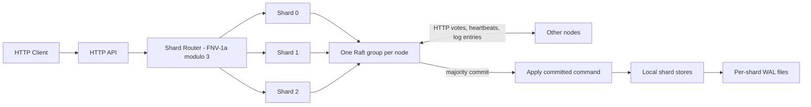

# GoCache

GoCache is a learning project for a concurrent key/value cache with TTL, LRU eviction, a newline JSON WAL, a small HTTP API, a simplified Raft group, and deterministic logical sharding.

## System architecture



## Run a 3-node cluster

Run each command in a separate terminal from the repository root:

```bash
go run ./cmd/server --id node1 --port 8001
go run ./cmd/server --id node2 --port 8002
go run ./cmd/server --id node3 --port 8003
```

Check liveness and Raft state:

```bash
curl http://localhost:8001/health
curl http://localhost:8002/health
curl http://localhost:8003/health
curl http://localhost:8001/raft/status
curl http://localhost:8002/raft/status
curl http://localhost:8003/raft/status
```

Send writes to the node whose `/raft/status` reports `leader`. A non-leader returns HTTP 503 with `not leader`; the server does not proxy the request.

```bash
curl -X PUT http://localhost:800X/kv/foo \
  -H 'Content-Type: application/json' \
  -d '{"value":"bar"}'
curl http://localhost:800X/kv/foo
curl -X DELETE http://localhost:800X/kv/foo
curl http://localhost:800X/raft/log
```

Set `"ttl": 10` in the PUT JSON to expire the value after ten seconds. Omit TTL or use zero for no expiration. Check routing with `curl http://localhost:800X/shard/foo`; routing is deterministic and reports the computed shard ID without hardcoded key mappings.

## Tests and benchmarks

```bash
go test ./...
go test -race ./...
go test -bench=. ./...
# Run benchmarks with the race detector too:
go test -race -bench=. ./...
```


