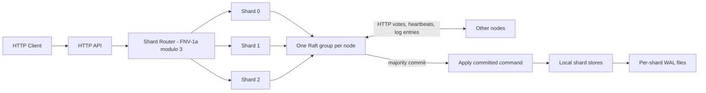
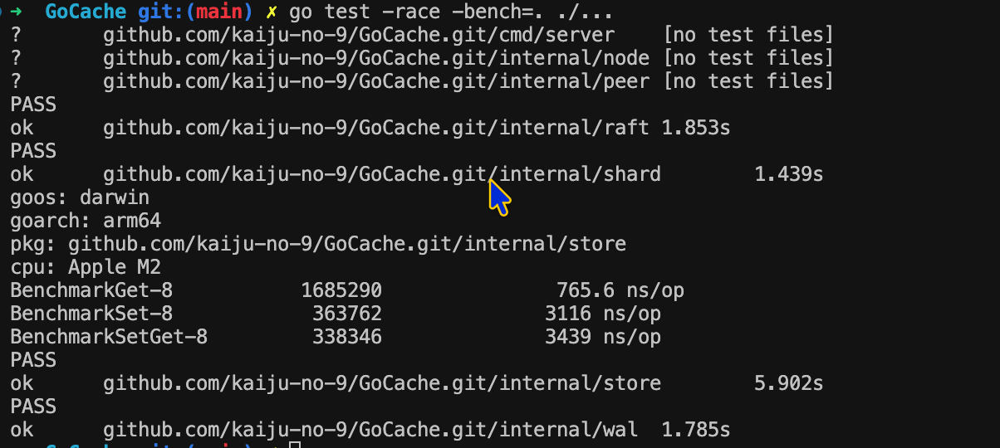

# GoCache

GoCache is a learning project for a concurrent key/value cache with TTL, LRU eviction, a newline JSON WAL, a small HTTP API, a simplified Raft group, and deterministic logical sharding.

## System architecture



Each node has three local stores selected by `FNV-1a(key) % 3`. All three logical shards share that node's single Raft group; this project does not implement independent Raft groups per shard. A leader appends writes to its log, replicates with HTTP `AppendEntries`, waits for majority commit, then applies the command to its shard store. Followers apply committed entries when they receive the updated leader commit index. TTL writes carry the same absolute expiry timestamp to every replica. Reads are local.

## Run a 3-node cluster

Run each command in a separate terminal from the repository root:

```bash
go run ./cmd/server --id node1 --port 8001
go run ./cmd/server --id node2 --port 8002
go run ./cmd/server --id node3 --port 8003
```

Check liveness and Raft state:

```bash
curl http://localhost:8001/health
curl http://localhost:8002/health
curl http://localhost:8003/health
curl http://localhost:8001/raft/status
curl http://localhost:8002/raft/status
curl http://localhost:8003/raft/status
```

Send writes to the node whose `/raft/status` reports `leader`. A non-leader returns HTTP 503 with `not leader`; the server does not proxy the request.

```bash
curl -X PUT http://localhost:800X/kv/foo \
  -H 'Content-Type: application/json' \
  -d '{"value":"bar"}'
curl http://localhost:800X/kv/foo
curl -X DELETE http://localhost:800X/kv/foo
curl http://localhost:800X/raft/log
```

Set `"ttl": 10` in the PUT JSON to expire the value after ten seconds. Omit TTL or use zero for no expiration. Check routing with `curl http://localhost:800X/shard/foo`; routing is deterministic and reports the computed shard ID without hardcoded key mappings.

## Tests and benchmarks

```bash
go test ./...
go test -race ./...
go test -bench=. ./...
# Run benchmarks with the race detector too:
go test -race -bench=. ./...
```

Sample benchmark output from an Apple M2 (Darwin ARM64), using `go test -race -bench=. ./...`:

| Benchmark | Sample time |
| --- | ---: |
| `BenchmarkGet` | 765.6 ns/op |
| `BenchmarkSet` | 3,116 ns/op |
| `BenchmarkSetGet` | 3,439 ns/op |

Benchmark results vary by machine and load. Re-run the command above to measure your system.

Benchmark output from the Apple M2 run:



## Limitations

GoCache is a learning implementation. It does not provide production-grade consensus, dynamic cluster membership, consistent hashing, shard rebalancing, snapshots, log compaction, linearizable reads, transactions, production authentication, TLS, production persistence guarantees, automatic leader proxying, or sophisticated failure detection. Raft logs are in memory; local WALs persist applied store mutations, not the full Raft protocol state. Restart recovery therefore does not provide the durability guarantees of a production consensus system.
